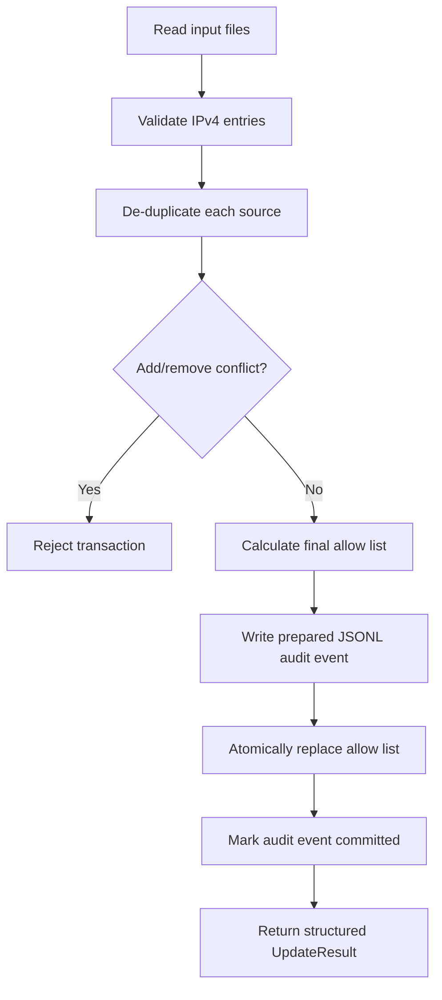

# Healthcare Access List Manager (hACL)

[](https://github.com/theluckydraco-stack/python-in-google-cybersecurity-certificate/actions/workflows/hacl-ci.yml)

hACL is a local Python access-governance tool that validates and applies approved IPv4 allow-list changes. It separates validation from persistence, returns structured results, uses recoverable atomic updates, and records each meaningful transaction as JSON Lines audit data.

This project remains inside the original Google Cybersecurity Professional Certificate repository so its development history is preserved.

## Why this project exists

The original certificate exercise removed IP addresses from an allow list. hACL develops that exercise into a testable access-governance workflow with explicit failure handling and auditable additions, removals, cleanup, and rejected requests.

hACL is not a HIDS or ITDR detector. Detection, identity correlation, integrity monitoring, and MITRE ATT&CK content belong in the separate `hACL-ITDR Detector` project.

## Engineering properties

- Strict IPv4 validation using Python's standard-library `ipaddress.IPv4Address`
- Rejection of IPv6, CIDR notation, malformed values, out-of-range octets, and ambiguous leading-zero notation
- Stable de-duplication with per-source duplicate counts
- Explicit conflict rejection when the same IP appears in both addition and removal requests
- Structured `UpdateResult` return value
- Atomic file replacement using a staged temporary file and `os.replace`
- Recoverable two-phase audit workflow: `prepared` then `committed`
- SHA-256 before/after hashes for transaction reconciliation
- JSON Lines audit records suitable for later parsing
- CLI arguments for all input and audit paths
- Unit and integration tests covering normal, edge, and failure paths
- GitHub Actions checks across supported Python versions

## Project layout

```text
healthcare_access_list_manager/
├── data/
│   ├── allow_list.txt
│   ├── remove_list.txt
│   └── add_list.txt
├── tests/
│   └── test_healthcare_acl.py
├── CHANGELOG.md
├── hACL.py
├── pyproject.toml
└── README.md
```

The runtime audit file is `data/audit_log.jsonl` and is intentionally excluded from version control.

## Transaction model



The audit event is written with `status: prepared` before the allow list is replaced. If execution stops between those steps, the next run compares the current allow-list hash with the event's before/after hashes and marks the event as either `committed_recovered` or `aborted_recovered`. A hash that matches neither state stops processing for manual review.

## Requirements

- Python 3.12 or later
- No runtime dependencies outside the Python standard library

Development checks use `pytest`, `pytest-cov`, `ruff`, and `mypy`.

## Installation for development

From the repository root:

```bash
python3 -m venv .venv
source .venv/bin/activate
python3 -m pip install --upgrade pip
python3 -m pip install -e "projects/healthcare_access_list_manager[dev]"
```

On Windows PowerShell, activate the environment with:

```powershell
.venv\Scripts\Activate.ps1
```

## Input files

Each input file contains one IPv4 address per line.

| File | Purpose |
|---|---|
| `allow_list.txt` | Current approved addresses |
| `remove_list.txt` | Addresses approved for removal |
| `add_list.txt` | Addresses approved for addition |

Example:

```text
192.168.1.10
10.20.30.40
172.16.5.12
```

## Run with default paths

```bash
cd projects/healthcare_access_list_manager
python3 hACL.py
```

Default paths:

```text
data/allow_list.txt
data/remove_list.txt
data/add_list.txt
data/audit_log.jsonl
```

## Run with explicit paths

```bash
python3 hACL.py \
  --allow data/allow_list.txt \
  --remove data/remove_list.txt \
  --add data/add_list.txt \
  --audit data/audit_log.jsonl
```

Print the returned result as JSON:

```bash
python3 hACL.py --json
```

## Python API

```python
from pathlib import Path

from hACL import update_allow_list

result = update_allow_list(
    allow_file=Path("data/allow_list.txt"),
    remove_file=Path("data/remove_list.txt"),
    add_file=Path("data/add_list.txt"),
    audit_file=Path("data/audit_log.jsonl"),
)

print(result.added_ips)
print(result.removed_ips)
print(result.changed)
```

`UpdateResult` distinguishes:

- Successfully added addresses
- Successfully removed addresses
- Removal requests that were not present
- Addition requests that were already present
- Invalid entries grouped by source
- Duplicate counts grouped by source
- Whether allow-list cleanup occurred
- Before and after SHA-256 hashes
- Audit event identifier and status

## Audit event

Each meaningful run writes one JSON object per line.

```json
{
  "schema_version": 1,
  "event_id": "5cae4df0-01aa-4c55-a718-88d5f7db7079",
  "timestamp_utc": "2026-07-25T14:30:45+00:00",
  "status": "committed",
  "original_count": 3,
  "final_count": 3,
  "changed": true,
  "removed_ips": ["10.0.0.5"],
  "added_ips": ["172.16.0.1"],
  "not_found_removals": [],
  "already_present_additions": [],
  "duplicate_counts": {
    "allow": 0,
    "remove": 0,
    "add": 0,
    "total": 0
  }
}
```

The actual event also includes invalid entries, file names, allow-list cleanup state, completion time, and before/after hashes.

## Test and quality checks

From the project directory:

```bash
python3 -m pytest --cov=hACL --cov-report=term-missing
ruff check hACL.py tests
mypy hACL.py
```

The current hardened test suite contains 20 tests and produced 93% statement coverage in local verification.

## Security decisions

- Input files are treated as approved change requests, not as trusted data.
- A missing, unreadable, or non-UTF-8 input file stops the transaction.
- The same address cannot be added and removed in one transaction.
- Duplicate values are counted by source but are not repeated in audit data.
- The complete allow list is not copied into the audit log.
- Before/after hashes permit transaction reconciliation without logging the full list.
- Corrupt JSONL audit data blocks further changes instead of being silently ignored.
- Importing `hACL.py` does not execute the update workflow.

## Scope and limitations

- IPv4 only; IPv6 and CIDR ranges are deliberately unsupported.
- Local file-based workflow; no authentication, API, database, or web interface.
- The JSONL audit file is rewritten atomically for each event. This is suitable for a small local project but is not intended as a high-volume logging system.
- IP addresses are technical identifiers, but real healthcare environments may classify related network data as sensitive. Production deployment would require an organisation-specific data-handling assessment.
- hACL manages approved access-list changes; it does not detect attacks.

## Baseline preservation

The pre-hardening implementation is preserved on:

```text
archive/hacl-v1-baseline-2026-07-25
```

Development of this hardened version occurs on:

```text
feature/hacl-v1-hardening
```

## Next project

`hACL-ITDR Detector` will build on this access-governance foundation with:

- Password-spray detection
- Employee and identity correlation
- Allow-list integrity monitoring
- Structured security alerts
- MITRE ATT&CK T1110.003 mapping
- Sigma and Microsoft Sentinel KQL drafts
- Investigation evidence and incident reporting
